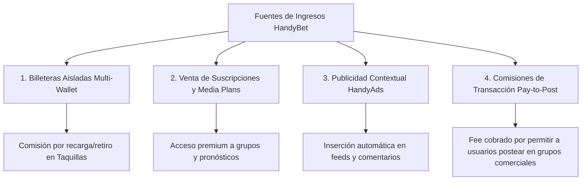

# Informe Empresarial de HandyBet / Yastaa
**Fecha:** 14 de Julio de 2026  
**Autor:** Orquestador SDD  
**Versión:** 1.3.0  
**Categoría:** Business & Monetization  

---

## 1. Resumen Ejecutivo

**HandyBet** (integrado bajo el ecosistema núcleo **Yastaa**) es una suite de red social inteligente orientada al iGaming y la monetización de contenido multimedia P2P. A diferencia de las redes sociales convencionales, HandyBet une el entretenimiento social, la mensajería instantánea y las apuestas deportivas/loterías en una plataforma unificada y modular, diseñada bajo las marcas de la suite:

*   **HandyPost (Feed):** El muro de contenido social interactivo donde los usuarios publican imágenes, videos y opiniones sobre deportes, pronósticos y loterías.
*   **HandyPlay (Juegos):** El simulador interactivo de apuestas y loterías que permite armar jugadas estructuradas.
*   **HandyChat (Mensajería):** Canales y grupos de apuestas y pronósticos en tiempo real.
*   **HandyLove & HandyShow:** Módulos de interacción y galerías multimedia.
*   **HandyNews:** Canal de noticias de iGaming e información deportiva.
*   **HandyPay & HandyBonus:** Sistema de monederos específicos y bonificaciones para incentivar la participación.
*   **HandyAds:** El motor publicitario contextual para empresas y anunciantes.
*   **HandyStore:** Compra y suscripción a planes de creadores.

La propuesta de valor empresarial radica en la **hiper-monetización del engagement**. La aplicación permite a agencias físicas de loterías y creadores de contenido (pronosticadores) establecer canales de comunicación cerrados o abiertos, cobrando directamente a los usuarios por acceder a datos premium, publicar anuncios o adquirir planes multimedia.

---

## 2. Modelo de Negocio e Incentivos de Monetización

La plataforma cuenta con un esquema de ingresos diversificado en cuatro pilares principales:

### 2.1. Billeteras Aisladas (Multi-Wallet por Grupo/Agencia)
*   **Mecánica:** Los fondos de los usuarios no están centralizados en una única cuenta global para todo. Existe una billetera específica por grupo o agencia afiliada.
*   **Valor Comercial:** Permite a las agencias locales gestionar su liquidez y sus propios cajeros sin riesgos cruzados. El balance depositado en la "Agencia A" solo es canjeable y jugable en la misma "Agencia A", garantizando que cada operador local respalde sus propios premios.

### 2.2. Venta de Suscripciones y Planes de Medios
*   **Mecánica:** Los grupos de pronosticadores deportivos configuran planes de acceso (`group_plans`) con diferentes esquemas de facturación (mensual, anual, por acción o 24 horas) y planes de medios (`media_plans`) que limitan la cantidad de fotos y videos que el creador puede publicar en su bóveda multimedia (`media_vault`).
*   **Valor Comercial:** Los usuarios compran membresías para obtener pronósticos deportivos premium y combinaciones de lotería con alta probabilidad de acierto, convirtiendo la aplicación en una plataforma SaaS para tipsters profesionales.

### 2.3. Motor Publicitario Contextual (HandyAds)
*   **Mecánica:** Anunciantes locales y empresas pueden comprar pautas publicitarias (`advertisements`) orientadas a canales deportivos específicos. La plataforma inyecta dinámicamente estos anuncios en el feed principal del canal y en el visor de comentarios de posts que no contienen material multimedia (aprovechando el espacio visual para mostrar publicidad dirigida).
*   **Requisito Legal:** Todo anunciante debe proveer un número de RIF válido (bajo máscara estricta `^[JGVEE]-[0-9]{8}-[0-9]$`) y pagar un costo por campaña (`cost_amount`), asegurando la legitimidad comercial del anunciante.

### 2.4. Transacciones y Comisiones por Publicar (Pay-to-Post)
*   **Mecánica:** Los dueños de grupos de apuestas o publicidad pueden habilitar la opción de cobro por publicar (`pay_to_post_enabled`), exigiendo un fee (`pay_to_post_fee`) deducido del monedero del usuario cada vez que crea una publicación en el muro del grupo.
*   **Valor Comercial:** Modera la calidad del contenido, previene el spam y genera un flujo continuo de microtransacciones donde la plataforma retiene una comisión por transacción (`platform_fee`).

---

## 3. Reglas de Negocio Críticas (Resumen Ejecutivo)

*   **RN-PF-01 (Perfil Obligatorio):** Todo perfil de usuario debe registrar un alias único (`username`), nombre completo, avatar opcional e intereses deportivos o de apuestas seleccionados. Esto personaliza el algoritmo de feed de HandyPost.
*   **RN-PF-02 (Privacidad de Invitados):** Los usuarios no autenticados (`guests`) actúan en modo lectura. Pueden ver perfiles públicos y publicaciones públicas del feed, pero no pueden comentar, participar en chats, generar apuestas ni recargar billeteras.
*   **RN-CH-01 (Grupos Rígidos):** Al crear un grupo de chat, se define su categoría principal (`apuestas`, `pronosticos`, `publicidad` o `compartir_media`), lo cual habilita y muestra componentes específicos en la interfaz del usuario.
*   **RN-BT-01 (Transacciones de Apuestas):** Toda apuesta generada por un usuario debe estar pendiente hasta que un Cajero autorizado la confirme mediante el cobro en efectivo o a través de la deducción de balance en caliente del monedero específico del grupo. Si el monedero no posee fondos, la base de datos aborta la transacción para evitar balances negativos.
*   **RN-BT-02 (Reclamación y Cobro de Premios):** Las apuestas ganadoras liquidadas pueden cobrarse cargando el balance al monedero del grupo o realizando un Pago Móvil bancario directo donde el cajero debe adjuntar el comprobante de pago digital para la auditoría de la plataforma.

---

## 4. Análisis de Valor Empresarial de la Base de Datos Real

El diseño físico de la base de datos de Supabase refleja exactamente las intenciones comerciales del proyecto:

1.  **Seguridad y Aislamiento RLS (Row Level Security):** La información financiera de los monederos (`wallets`) y transacciones (`transactions`) cuenta con políticas estrictas que impiden la modificación directa por el cliente. Las operaciones que alteran balances se realizan a través de funciones almacenadas seguras (`RPC`) que operan bajo `SECURITY DEFINER`, garantizando que ninguna brecha en la app cliente pueda falsear balances.
2.  **Trazabilidad Financiera Auditable:** La tabla `transactions` cuenta con referencias a emisores (`sender_id`), receptores (`receiver_id`), monederos (`wallet_id`), códigos de referencia bancaria (`reference_code`) y comprobantes físicos (`receipt_image_url`). Esto permite una contabilidad impecable para resolver disputas entre jugadores y cajeros de agencias.
3.  **Monetización de Contenido:** El acoplamiento entre `user_subscriptions`, `media_plans` y `media_vault` permite vender acceso a archivos protegidos. La base de datos garantiza la integridad al verificar la fecha de expiración (`expires_at`) de forma automática a través de políticas RLS antes de conceder la lectura del recurso multimedia.
