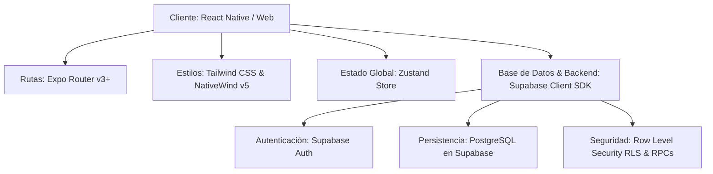

# Informe Técnico de HandyBet / Yastaa
**Fecha:** 14 de Julio de 2026  
**Autor:** Orquestador SDD  
**Versión:** 1.3.0  
**Categoría:** Technical & Architecture  

---

## 1. Arquitectura del Proyecto

La aplicación está construida sobre una arquitectura moderna basada en **TypeScript** y orientada al desarrollo multiplataforma (Web y Mobile) empleando el ecosistema de **React Native** con el compilador web de Expo:

### 1.1. Tecnologías Clave
*   **Core:** React Native / Expo SDK con soporte universal para Web y Mobile.
*   **Enrutamiento:** [Expo Router](https://docs.expo.dev/router/introduction/) utilizando sistema de carpetas y layouts jerárquicos:
    *   `(auth)`: Flujo de inicio de sesión.
    *   `(dashboard)`: Módulos administrativos para Taquilla (cajeros) y Monetización-Ads (anunciantes/dueños de agencias).
    *   `(tabs)`: Secciones principales del usuario (Feed, Wallet, Amigos, Juegos, Perfiles, Grupos).
*   **Estilos y UI:** [Tailwind CSS](https://tailwindcss.com/) acoplado con **NativeWind** para la compilación de estilos nativos rápidos. Se emplea un tema de UI premium oscuro gestionado de forma dinámica mediante variables semánticas en formato `oklch()` (como `bg-background`, `bg-card`, `border-border`, `text-primary` y `text-secondary`).
*   **Manejo de Estado:** [Zustand](https://github.com/pmndrs/zustand) en `src/store/useHandyBetStore.ts` para sincronizar estados volátiles como el estatus del escáner de taquilla, borradores de apuestas (`currentBetDraft`), códigos de ticket activos y sesiones simuladas (`mockSession`).
*   **Servicio Backend:** [Supabase](https://supabase.com/) como Backend-as-a-Service (BaaS) con conectividad directa a PostgreSQL, provisión de Auth y almacenamiento de archivos.

---

## 2. Catálogo Detallado de Componentes Creados

### 2.1. Layouts y Envolventes
*   **[HandyBetLayout.tsx](file:///c:/Users/DELL/Documents/dPana%20Projects/frontends/yastaa-app/src/components/layout/HandyBetLayout.tsx):** Estructura universal responsiva. En Web renderiza tres columnas independientes con scroll propio (Sidebar Izquierda con menú de aplicaciones y logos, Contenedor Central para la vista activa y Sidebar Derecha para widgets rápidos e información de apuestas). En Mobile colapsa en un layout de pestañas inferior con accesos rápidos.
*   **[SidebarPopover.tsx](file:///c:/Users/DELL/Documents/dPana%20Projects/frontends/yastaa-app/src/components/layout/SidebarPopover.tsx):** Popover flotante para mostrar opciones adicionales en el perfil del Sidebar.

### 2.2. Componentes de Feed e Interacción Social
*   **[CreatePostWidget.tsx](file:///c:/Users/DELL/Documents/dPana%20Projects/frontends/yastaa-app/src/components/feed/CreatePostWidget.tsx):** Barra de redacción compacta. Al hacer clic en el input de entrada, levanta un modal de composición a pantalla completa enriquecido con selectores de imagen/video (`FileDropzone`), hashtags de apuestas y asignación a grupos.
*   **[PostItem.tsx](file:///c:/Users/DELL/Documents/dPana%20Projects/frontends/yastaa-app/src/components/feed/PostItem.tsx):** Renderiza publicaciones individuales del feed. Soporta:
    *   *Botón Seguir/Siguiendo* alineado con el avatar del creador.
    *   *Botón de Opciones (3 puntos)* que muestra un menú en fila para Compartir, Activar/desactivar notificaciones y Ocultar post.
    *   *Acciones de me gusta, comentarios y compartir* reubicados y optimizados.
*   **[PostMediaViewer.tsx](file:///c:/Users/DELL/Documents/dPana%20Projects/frontends/yastaa-app/src/components/feed/PostMediaViewer.tsx):** Visor flotante de comentarios y material multimedia. Cuenta con una optimización crítica: si la publicación **no contiene imágenes ni videos**, el visor inyecta automáticamente en la mitad izquierda del contenedor un anuncio interactivo de **HandyAds** (promociones de lotería, rifas o agencias) con redireccionamiento web, manteniendo el feed de comentarios visible a la derecha.
*   **[ShareModal.tsx](file:///c:/Users/DELL/Documents/dPana%20Projects/frontends/yastaa-app/src/components/feed/ShareModal.tsx):** Modal interactivo para compartir posts organizados en pestañas dinámicas (Grupo, Canal, Usuario, Amigo), integrando notificaciones Toast animadas de confirmación.

### 2.3. Logotipos de Marca (`src/components/ui/`)
Colección de logotipos vectoriales optimizados bajo la identidad de la suite HandyBet, todos configurados con el segundo fragmento de texto en fuente en negrita (`font-bold`) para consistencia tipográfica:
*   `Logo.tsx` (HandyBet)
*   `HandyAdsLogo.tsx` (Anuncios)
*   `HandyPostLogo.tsx` (Feed)
*   `HandyPlayLogo.tsx` (Juegos/Lotería)
*   `HandyChatLogo.tsx` (Chat)
*   `HandyPayLogo.tsx` (Pasarelas)
*   `HandyBonusLogo.tsx` (Bonificaciones)
*   `HandyStoreLogo.tsx` (Tienda de Medios)
*   `HandyLoveLogo.tsx` & `HandyShowLogo.tsx`

---

## 3. Especificación Física de la Base de Datos (Supabase PostgreSQL)

El esquema cuenta con un fuerte tipado relacional a nivel de base de datos a través de llaves foráneas (`FOREIGN KEY`), restricciones de validación (`CHECK`), triggers e índices.

### 3.1. Tablas e Identidades de Usuario

#### Tabla: `profiles`
Almacena la identidad de los usuarios, vinculados a la tabla nativa de autenticación de Supabase.
*   `id` (`UUID`, `PRIMARY KEY`, references `auth.users`).
*   `username` (`TEXT`, `UNIQUE`, `NOT NULL`).
*   `full_name` (`TEXT`, nullable).
*   `avatar_url` (`TEXT`, nullable).
*   `role` (`yastaa_role`, `DEFAULT 'player'`). Valores: `player`, `cashier`, `company_owner`, `admin`.
*   `interests` (`TEXT[]`, `DEFAULT '{}'::TEXT[]`, `NOT NULL`).
*   `phone_whatsapp` (`VARCHAR(20)`, nullable) — Identificador telefónico para integraciones de mensajería externa.
*   `whatsapp_handle` (`VARCHAR(50)`, nullable) — Nombre de usuario o alias en la plataforma WhatsApp.
*   `created_at` (`TIMESTAMPTZ`, `DEFAULT NOW()`).

#### Tabla: `friendships`
Relación P2P bidireccional entre perfiles de usuario.
*   `user_id_1` (`UUID`, references `profiles(id)`).
*   `user_id_2` (`UUID`, references `profiles(id)`).
*   `status` (`VARCHAR(20)`, `CHECK (status IN ('pending', 'accepted'))`, `DEFAULT 'pending'`).
*   `created_at` (`TIMESTAMPTZ`, `DEFAULT NOW()`).
*   *Restricción:* Llave primaria compuesta `PRIMARY KEY (user_id_1, user_id_2)`.

---

### 3.2. Estructura de Canales y Grupos

#### Tabla: `channels`
Canales de organización o agencias deportivas.
*   `id` (`UUID`, `PRIMARY KEY`, `DEFAULT gen_random_uuid()`).
*   `name` (`TEXT`, `NOT NULL`).
*   `owner_id` (`UUID`, references `profiles(id)`).
*   `created_at` (`TIMESTAMPTZ`, `DEFAULT NOW()`).

#### Tabla: `groups`
Salas de interacción y chats asociados a los canales.
*   `id` (`UUID`, `PRIMARY KEY`, `DEFAULT gen_random_uuid()`).
*   `channel_id` (`UUID`, references `channels(id)`).
*   `short_code` (`VARCHAR(4)`, `UNIQUE`, `NOT NULL`). Código corto de 4 dígitos para enlaces de invitación rápida.
*   `name` (`TEXT`, `NOT NULL`).
*   `type` (`yastaa_group_type`, `NOT NULL`). Valores: `apuestas`, `pronosticos`, `publicidad`, `compartir_media`.
*   `config` (`JSONB`, `DEFAULT '{}'::jsonb`).
*   `owner_id` (`UUID`, references `profiles(id)`).
*   `visibility_level` (`VARCHAR(30)`, `DEFAULT 'todos'`, `CHECK` list). Valores: `todos`, `amigos`, `amigos_especificos`, `nadie`, `amigos_de_mis_amigos`, `amigos_de_mis_miembros`.
*   `created_at` (`TIMESTAMPTZ`, `DEFAULT NOW()`).

---

### 3.3. Monederos, Transacciones y Apuestas (iGaming)

#### Tabla: `wallets`
Billeteras aisladas asociadas a grupos específicos (Multi-Wallet).
*   `id` (`UUID`, `PRIMARY KEY`, `DEFAULT gen_random_uuid()`).
*   `user_id` (`UUID`, references `profiles(id)`).
*   `group_id` (`UUID`, references `groups(id)`).
*   `balance` (`NUMERIC(15,2)`, `DEFAULT 0.00`, `CHECK (balance >= 0.00)`).
*   `created_at` (`TIMESTAMPTZ`, `DEFAULT NOW()`).
*   *Restricción:* Unicidad por usuario y grupo (`UNIQUE(user_id, group_id)`).

#### Tabla: `bets`
Registro formal de tickets de jugadas en el sistema.
*   `id` (`UUID`, `PRIMARY KEY`, `DEFAULT gen_random_uuid()`).
*   `group_id` (`UUID`, references `groups(id)`).
*   `user_id` (`UUID`, references `profiles(id)`).
*   `bet_code` (`VARCHAR(12)`, `UNIQUE`, `NOT NULL`). Código único de jugada (ej. `1234-123456`).
*   `bet_data` (`JSONB`, `NOT NULL`). Contiene la matriz con loterías, tipo de juego (triple, terminal, animalito, permuta), horarios y multiplicadores.
*   `amount` (`NUMERIC(15,2)`, `CHECK (amount > 0.00)`). Monto apostado.
*   `potential_prize` (`NUMERIC(15,2)`, `DEFAULT 0.00`, `CHECK (potential_prize >= 0.00)`). Premio potential si resulta ganadora.
*   `status` (`yastaa_bet_status`, `DEFAULT 'pendiente'`). Valores: `pendiente`, `confirmada`, `ganadora`, `perdedora`, `cobrada`.
*   `ticket_number` (`TEXT`, nullable) — Número del ticket físico impreso en la taquilla.
*   `payment_proof_url` (`TEXT`, nullable) — Comprobante bancario/pago móvil digital cargado.
*   `processed_by` (`UUID`, references `profiles(id)`). Cajero que procesa la operación.
*   `created_at` (`TIMESTAMPTZ`, `DEFAULT NOW()`).

#### Tabla: `transactions`
Ledger o libro mayor de movimientos contables y bancarios.
*   `id` (`UUID`, `PRIMARY KEY`, `DEFAULT gen_random_uuid()`).
*   `wallet_id` (`UUID`, references `wallets(id)`).
*   `amount` (`NUMERIC(15,2)`, `CHECK (amount > 0.00)`).
*   `type` (`yastaa_tx_type`, `NOT NULL`). Valores: `deposito`, `retiro`, `debito_apuesta`, `credito_premio`, `compra_suscripcion`.
*   `status` (`yastaa_tx_status`, `DEFAULT 'pendiente'`). Valores: `pendiente`, `aprobado`, `rechazado`.
*   `reference_code` (`TEXT`, nullable) — Número de referencia bancaria o móvil.
*   `receipt_image_url` (`TEXT`, nullable) — Imagen del recibo.
*   `processed_by` (`UUID`, references `profiles(id)`).
*   `sender_id` (`UUID`, references `profiles(id)`, nullable) — Emisor en transacciones P2P.
*   `receiver_id` (`UUID`, references `profiles(id)`, nullable) — Receptor en transacciones P2P.
*   `group_id` (`UUID`, references `groups(id)`, nullable) — Grupo donde se realiza la operación.
*   `platform_fee` (`DECIMAL(15,2)`, `DEFAULT 0.00`) — Comisión retenida por la plataforma.
*   `created_at` (`TIMESTAMPTZ`, `DEFAULT NOW()`).

---

### 3.4. Publicaciones y Muro Social

#### Tabla: `posts`
Publicaciones realizadas en los feeds personales y de grupos.
*   `id` (`UUID`, `PRIMARY KEY`, `DEFAULT gen_random_uuid()`).
*   `author_id` (`UUID`, references `profiles(id)`).
*   `group_id` (`UUID`, references `groups(id)`, nullable) — Nulo si se publica en el feed personal del muro global.
*   `content` (`TEXT`, `NOT NULL`).
*   `media_url` (`TEXT`, nullable).
*   `media_type` (`VARCHAR(20)`, `CHECK (media_type IN ('photo', 'video'))`, nullable).
*   `visibility_level` (`VARCHAR(30)`, `CHECK (visibility_level IN ('todos', 'amigos', 'amigos_especificos', 'nadie', 'amigos_de_mis_amigos'))`, `DEFAULT 'todos'`).
*   `post_type` (`VARCHAR(20)`, `CHECK (post_type IN ('regular', 'advertisement'))`, `DEFAULT 'regular'`).
*   `payment_status` (`VARCHAR(30)`, `CHECK (payment_status IN ('none_required', 'pendiente_pago', 'pagado'))`, `DEFAULT 'none_required'`).
*   `created_at` (`TIMESTAMPTZ`, `DEFAULT NOW()`).

---

### 3.5. Moderación, Planes y Membresías (SaaS)

#### Tabla: `group_plans`
Planes de acceso a grupos privados y de pronósticos.
*   `id` (`UUID`, `PRIMARY KEY`, `DEFAULT gen_random_uuid()`).
*   `group_id` (`UUID`, references `groups(id)`).
*   `name` (`TEXT`, `NOT NULL`).
*   `price` (`DECIMAL(15,2)`, `DEFAULT 0.00`, `CHECK (price >= 0.00)`).
*   `billing_type` (`VARCHAR(30)`, `CHECK (billing_type IN ('pay_per_action', '24_hours', 'mensual', 'anual'))`, `NOT NULL`).
*   `created_at` (`TIMESTAMPTZ`, `DEFAULT NOW()`).

#### Tabla: `group_rules`
Reglas de moderación y configuraciones específicas de monetización del grupo.
*   `id` (`UUID`, `PRIMARY KEY`, `DEFAULT gen_random_uuid()`).
*   `group_id` (`UUID`, `UNIQUE`, references `groups(id)`).
*   `permitir_publicar_feeds` (`BOOLEAN`, `DEFAULT TRUE`).
*   `permitir_publicar_publicidad` (`BOOLEAN`, `DEFAULT FALSE`).
*   `terms_text` (`TEXT`, nullable).
*   `onboarding_questionnaire` (`JSONB`, `DEFAULT '{"questions": []}'::jsonb`) — Preguntas requeridas para el ingreso al grupo.
*   `pay_to_post_enabled` (`BOOLEAN`, `DEFAULT FALSE`).
*   `pay_to_post_fee` (`DECIMAL(15,2)`, `DEFAULT 0.00`, `CHECK (pay_to_post_fee >= 0.00)`).

#### Tabla: `memberships`
Registro de miembros afiliados a grupos privados y sus respuestas de onboarding.
*   `id` (`UUID`, `PRIMARY KEY`, `DEFAULT gen_random_uuid()`).
*   `group_id` (`UUID`, references `groups(id)`).
*   `user_id` (`UUID`, references `profiles(id)`).
*   `plan_id` (`UUID`, references `group_plans(id)`, nullable).
*   `status` (`VARCHAR(30)`, `CHECK (status IN ('onboarding_pending', 'active', 'blocked'))`, `DEFAULT 'onboarding_pending'`).
*   `onboarding_answers` (`JSONB`, `DEFAULT '{}'::jsonb`).
*   `valid_until` (`TIMESTAMPTZ`, nullable) — Fecha de vencimiento del acceso pagado.
*   `created_at` (`TIMESTAMPTZ`, `DEFAULT NOW()`).
*   *Restricción:* Llave única compuesta `UNIQUE (group_id, user_id)`.

#### Tabla: `advertisements` (HandyAds)
Anuncios configurados para canales y grupos comerciales.
*   `id` (`UUID`, `PRIMARY KEY`, `DEFAULT gen_random_uuid()`).
*   `channel_id` (`UUID`, references `channels(id)`).
*   `business_name` (`TEXT`, `NOT NULL`).
*   `business_rif` (`TEXT`, `NOT NULL`, `CHECK (business_rif ~ '^[JGVEE]-[0-9]{8}-[0-9]$')`). RIF legal validado por regex.
*   `business_contact` (`TEXT`, `NOT NULL`).
*   `ad_copy` (`TEXT`, `NOT NULL`).
*   `media_url` (`TEXT`, `NOT NULL`).
*   `target_deeplink` (`TEXT`, nullable) — Ruta interna o externa de redireccionamiento.
*   `cost_amount` (`NUMERIC(15,2)`, `CHECK (cost_amount > 0.00)`). Costo pagado por la pauta.
*   `is_active` (`BOOLEAN`, `DEFAULT TRUE`).
*   `created_at` (`TIMESTAMPTZ`, `DEFAULT NOW()`).

#### Tablas: `media_plans`, `media_vault` y `user_subscriptions`
Gestionan el contenido premium de la bóveda multimedia P2P (`media_vault`), asignando archivos (`photo`/`video`) a planes específicos (`media_plans`) que los usuarios adquieren mediante una suscripción (`user_subscriptions`).

---

## 4. Análisis de Seguridad y Rendimiento en Base de Datos

### 4.1. Procedimientos Almacenados Seguros (RPC)
Para evitar que el cliente altere directamente los saldos financieros, todas las mutaciones complejas se realizan en el motor de base de datos a través de funciones ejecutadas con privilegios elevados (`SECURITY DEFINER`):
1.  **`confirm_bet_cashier(p_bet_code, p_payment_method, p_reference_code)`**: Valida el rol de cajero, busca el ticket, bloquea la fila del monedero del jugador (`FOR UPDATE`) para evitar condiciones de carrera, descuenta el saldo si el pago es a través de wallet, o registra las transacciones espejo si es efectivo, actualizando finalmente el estado del ticket a `confirmada`.
2.  **`payout_bet_cashier(p_bet_code, p_payout_method, p_payment_proof)`**: Liquida la apuesta ganadora. Si se paga al monedero, incrementa el balance y registra el movimiento de crédito en las transacciones. Si es pago móvil directo, registra la transacción como un egreso vinculando el comprobante bancario.
3.  **`purchase_media_subscription(p_plan_id)`**: Deduce el costo del plan del monedero del usuario en el grupo correspondiente de manera atómica, registra la transacción de compra e inserta la suscripción con su tiempo de expiración calculado.

### 4.2. Triggers y Automatizaciones
*   **`on_auth_user_created`**: Lanza la función `handle_new_user()` inmediatamente después de que un usuario se registra a través de Supabase Auth, insertando automáticamente su registro en la tabla `profiles` con valores por defecto seguros (`player`), garantizando la integridad referencial.

### 4.3. Índices de Rendimiento Diseñados
Para mitigar la latencia de respuesta en consultas de alta concurrencia, se aplican los siguientes índices B-Tree:
*   `idx_bets_code` en `bets(bet_code)`: Agiliza las búsquedas de tickets en la taquilla del cajero.
*   `idx_wallets_user_group` en `wallets(user_id, group_id)`: Optimiza la consulta y verificación de saldos en caliente durante las jugadas.
*   `idx_groups_channel` en `groups(channel_id)`: Acelera la carga de grupos asociados a canales organizacionales.
